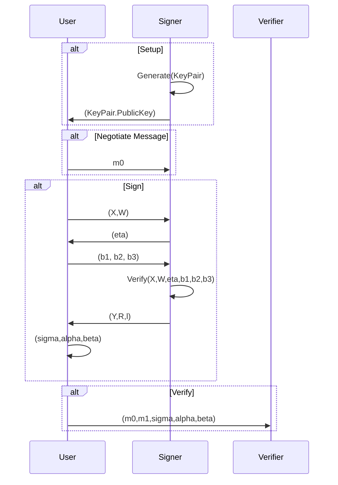

# Okamoto (2006) Blind Signatures
## Efficient Blind and Partially Blind Signatures Without Random Oracles

Implementations of blind and partially blind signatures over elliptic curves as described in [Efficient Blind and Partially Blind Signatures Without Random Oracles](https://link.springer.com/content/pdf/10.1007%2F11681878_5.pdf).

This library provides a usable implementation of the algorithm without regard to its eventual use. Uses such as in a "mint", are left to the implementor.

The key innovation of the paper and therefore of this library is in permitting *partially* blind signatures where the signer and the user share some component of the message (potentially the null string) openly. This would make it useful, for example, in a mint application where the mint (bank) executes out-of-band logic to verify the user's balance before signing an ATM-like withdrawal of an agreed denomination.

# Features

* `bls12_381_plain` (default): Plain implementation over the [BLS12-128](http://docs.rs/bls12_381) elliptic curve secure against constant-depth concurrent adversaries (not secure against fully concurrent adversaries).

# Sequence

# References

Using algorithms from:
* [Efficient Blind and Partially Blind Signatures Without Random Oracles](https://link.springer.com/content/pdf/10.1007%2F11681878_5.pdf).
* [bls12_381 Rust Crate](https://docs.rs/bls12_381/latest/bls12_381/)
* [Efficient Implementation of Pairing-Based Cryptosystems](https://link.springer.com/content/pdf/10.1007/s00145-004-0311-z.pdf)
* [Efficient Algorithms for Pairing-Based Cryptosystems](https://www.researchgate.net/profile/Hae-Kim-10/publication/40721105_Efficient_Algorithms_for_Pairing-Based_Cryptosystems/links/00463516819ba229e8000000/Efficient-Algorithms-for-Pairing-Based-Cryptosystems.pdf)
* [Pairing Friendly Curves](https://www.ietf.org/archive/id/draft-irtf-cfrg-pairing-friendly-curves-10.html#name-for-128-bit-security)

# Licensing

* [GPL 3.0](https://spdx.org/licenses/GPL-3.0-only.html) or [GPL 3.0](./LICENSE-GPL-3.0.md)
* [Commercial](./LICENSE-COMMERCIAL.md)

# Copyright

Copyright (c) Jeffrey Hohenstein <jeffrey.hohenstein@gmail.com>

### Contribution

Unless you explicitly state otherwise, any contribution intentionally
submitted for inclusion in the work by you shall be licensed as above, without any additional terms or
conditions.
